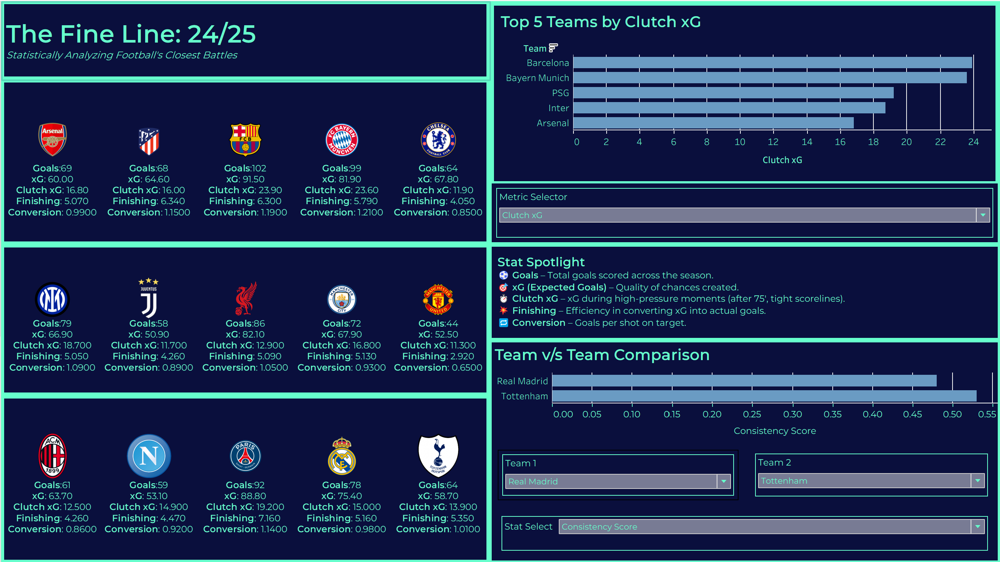
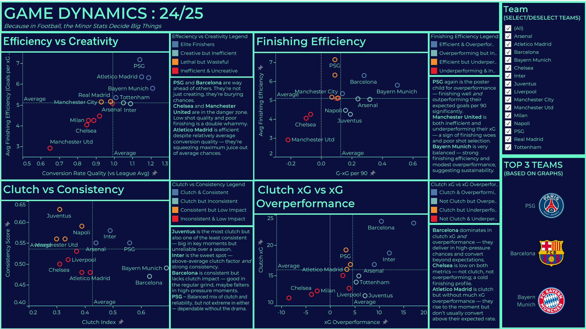

> **"Because in football, it's the fine margins that decide glory."**  

This project dives deep into the **2024–25 European football season** — engineering features, analyzing performance trends, and building **interactive Tableau dashboards** to visualize the story behind the stats.

---

## 📌 Overview
- **Objective:** Understand how small statistical edges translate into big results for elite football clubs.  
- **Scope:** Data processing in Python + advanced visualizations in Tableau.  
- **Key Tools:** `pandas`, `numPy`, `matplotlib`, `seaborn`, `Tableau`.  
- **Future Scope:** Adding some ML features.
---

## 🚀 Features
- **Data Engineering:** Cleaned and transformed match & player data into a structured analytics-ready format.
- **Exploratory Analysis:** Identified trends in goals, assists, possession, and shot quality.
- **Custom Metrics:** Built metrics like **Clutch xG**, **Finishing Efficiency**, **Consistency Score** and **Momentum Score**.
- **Interactive Dashboards:** Multiple Tableau views for team metrics and featured insights.
- **Exportable Insights:** Ready-to-use CSV outputs for further modeling.

---

## 📊 Dashboards

### 1️⃣ Fine Line: 24/25

**Highlights:**
- Comparative analysis of top clubs  
- Shot conversion rates, possession trends  
- Club logos and clean visual branding  
-Interactive parameters and filters

### 2️⃣ Game Dynamics: 24/25

**Highlights:**
- Four graphs based on comparison of multiple metrics 
- Advanced KPIs to identify match-deciding moments  

🔗 **[View on Tableau Public](https://public.tableau.com/views/MarginsofGlory/MARGINSOFGLORY?:language=en-GB&:sid=&:redirect=auth&:display_count=n&:origin=viz_share_link)** (maximize for better interaction and visuals)

---

## 📂 Project Structure
```plaintext
├── images/ # Tableau screenshots & banner
│ ├── banner.png
│ ├── FineLine.png
│ └── GameDynamics.png
│
├── input data/ # Cleaned CSV outputs (15 teams)
│ ├── Liverpool - Sheet1.csv
│ ├── Manchester City - Sheet1.csv
│ ├── Arsenal - Sheet1.csv
│ ├── ...
│ └── Barcelona - Sheet1.csv
│
├── output data
│ └── Football_Analytics_Feature_Engineering.ipynb # Python notebook for data processing & feature engineering
│
├── Margins of Glory.twbx # Tableau workbook
├── requirements.txt # Python dependencies
├── README.md # Project documentation
├── .gitignore #keeps junk files out of GitHub
├── .gitattributes # Mainly for consistent line endings & file handling across OSs
└── LICENSE # MIT License
```
---

## ⚙️ Setup & Usage
#### **Clone the repository**
```bash
git clone https://github.com/saanitbansal-619/Margins-of-Glory.git
cd Margins-of-Glory
```
#### **Install dependencies**
```bash
pip install -r requirements.txt
```
#### **Run the notebook**
```bash
jupyter notebook Football_Analytics_Feature_Engineering.ipynb
```
#### **Open Tableau dashboard**
- Load Margins of Glory.twbx in Tableau Desktop
- Or explore it online via Tableau Public link above (maximize for better interaction and visuals).

---

## 🧠 Key Learnings
- Translating raw football data into meaningful performance metrics.
- Using feature engineering to create custom KPIs.
- Blending Python analytics with Tableau visualization and storytelling.
- Designing dashboards that balance aesthetics with clarity.

---

## 📊 Data Source
- **Matches for 15 Individual Football Teams** : [FBref.com](https://fbref.com) (Manually copy pasted into 15 individual CSVs, this site does not permit Web Scraping)
- Data collected under their [Terms of Use](https://www.sports-reference.com/data_use.html?__hstc=218152582.267a7d3517d56cf80bbc6853dae76565.1753774398002.1753992470499.1755109831907.8&__hssc=218152582.1.1755109831907&__hsfp=3195775484)

---

## 📜 License
This project is licensed under the MIT License – feel free to fork and build upon it.

---

## ✨ Author
**Saanit Bansal**
- 📧 **[saanit1t5bansal@gmail.com]**
- 💼 **[LinkedIn](https://www.linkedin.com/in/saanit-bansal-681874293)**
- 🐙 **[GitHub](https://github.com/saanitbansal-619)**